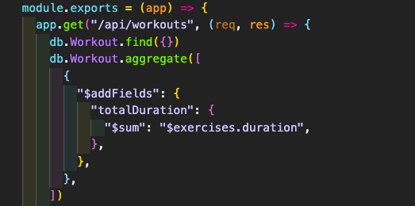

   
# Fitness Tracker  

## Description  
Application using MongoDB as the database, mongoose ORM and express server for a user to enter and update various workouts that can be viewed and added to. The purpose is for the user to track and view all their fitness activity.    

## Table of Contents  
* [Installation](#installation)  
* [Usage](#usage)  
* [Credits](#credits)   
* [License](#license)  
* [Questions](#questions)  
* [Deployed App](#deployed-app)

## Installation  
app runs as is in browser. No need for any installs or downloads  

## Usage 

This app has various public JavaScript and HTML files. The public index.js holds an init function to initialize the frunt end functionality of the app. stats.js holds functions to generate all the stat reports in the graphs. workout.js holds functions to tally up the exercise totals when the user adds to current workouts, a function to render the workout summary and the workout text. exercise.js holds all of the query selectors to handle the form inout and buttons. also to clear the inputs after entries are made. api.js is where all the front end fetch requests are calling from the back end routes.  

Under the models folder there is a Workout.js that creates the collection schema for the mongoDB database. The model is brought in for the back end routes.

api-routes.js is where the api end points are being hit to find, create and update user inputs. here is where the aggregation comes into play to add a field to the current collection and add the total duration of all workouts entered.

## Credits  
  
[addFields for mongoDB](https://docs.mongodb.com/manual/reference/operator/aggregation/addFields/)  
[sum aggregation mongoDB](https://docs.mongodb.com/manual/reference/operator/aggregation/sum/) 
[aggregate mongoose](https://mongoosejs.com/docs/api.html#aggregate_Aggregate) 

## License  
MIT  

## Questions  
Contact information for any questions about this application:
* https://github.com/lucahendicott  
* lucahdavid88@gmail.com  

## Deployed App
[Track your fitness!](https://tranquil-wave-32843.herokuapp.com/)
